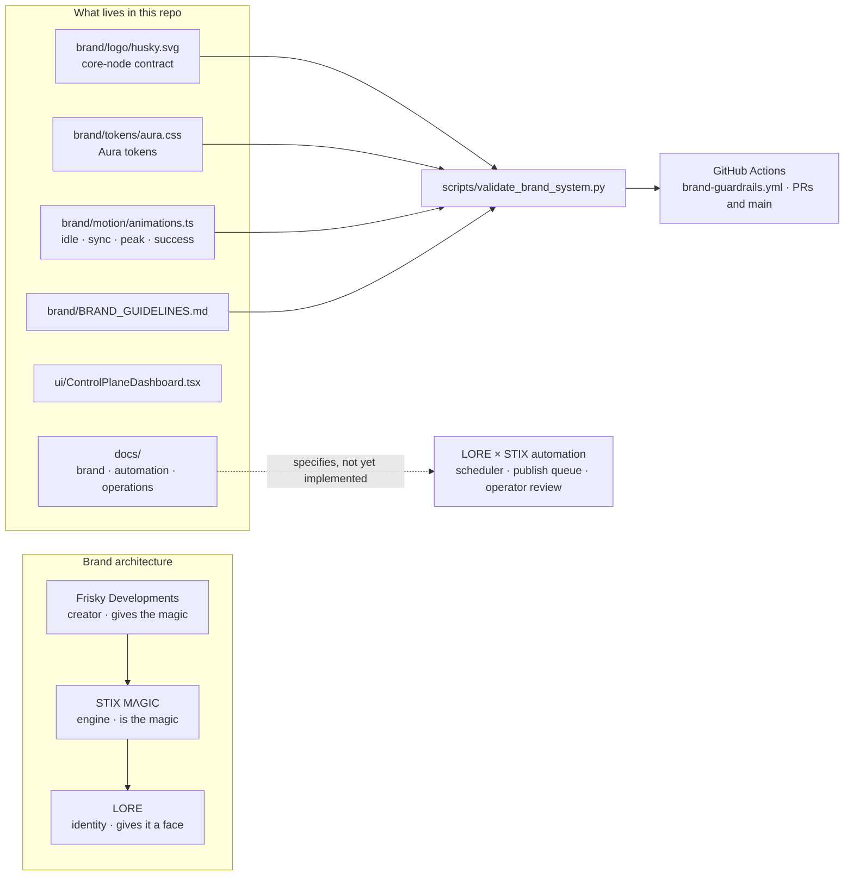

# STIX MΛGIC / LORE Ecosystem

 

This repository defines the brand and system thinking behind a small creative-tech ecosystem with three distinct roles:

- **Frisky Developments** is the creator: the warm, playful studio signature behind the work.
- **STIX MΛGIC** is the engine: the expressive system where the magic itself happens.
- **LORE** is the identity layer: the profile and presence that gives that magic a face.

The goal is not to flatten these into one vague umbrella brand. The goal is to make the relationship legible so collaborators can design, write, and build with a shared understanding of what each layer is responsible for.

## Brand architecture at a glance

- **Frisky gives the magic.**
- **STIX is the magic.**
- **LORE gives that magic identity.**

Use Frisky Developments when speaking about authorship, studio intent, ecosystem stewardship, and the character behind the products. Use STIX MΛGIC when speaking about the expressive engine, transformation experience, and system behavior. Use LORE when speaking about user identity, presence, profile, and self-expression.

## How the pieces fit



`brand/logo/husky.svg` is currently a source-of-truth **placeholder container** that keeps the `#core-node` contract. Its comments say the official husky vector still needs to be dropped in without changing the geometry.

## Documentation map

- [`docs/brand/architecture.md`](docs/brand/architecture.md) — ecosystem structure, naming logic, and role boundaries.
- [`docs/brand/frisky-developments.md`](docs/brand/frisky-developments.md) — parent-brand definition, voice, and logo direction.
- [`docs/stix-system-handoff.md`](docs/stix-system-handoff.md) — product/system guidance for STIX as the state-driven portal shell.
- [`docs/automation/architecture.md`](docs/automation/architecture.md) — technical plan for the LORE × STIX premium automation system.
- [`docs/automation/workflows.md`](docs/automation/workflows.md) — baseline authoring-to-publish workflow definitions.
- [`docs/automation/pupbot-admin-runtime.md`](docs/automation/pupbot-admin-runtime.md) — admin authority, link-handshake, and persona-mode runtime contract for GeminiPUP.
- [`docs/automation/connectors.md`](docs/automation/connectors.md) — connector adapter contracts and safety constraints.
- [`docs/automation/guardrails.md`](docs/automation/guardrails.md) — operational safety rules for future automation deployments.
- [`docs/operations/release-checklist.md`](docs/operations/release-checklist.md) — pre-release, deployment, and rollback checklist.
- [`brand/BRAND_GUIDELINES.md`](brand/BRAND_GUIDELINES.md) — machine-readable Frisky husky logo variants, Aura tokens, and core-node motion rules.

## Repo note

At the moment, the repository is primarily documentation-led. That means the brand system should avoid making unsupported claims about live product maturity. The docs define the intended architecture and design language so future implementation work can stay coherent.

## Validation

Run the brand guardrail validator locally before opening a PR:

```bash
python scripts/validate_brand_system.py
```

## Repository layout

```text
brand/        logo container, Aura tokens (CSS), motion contracts (TS), guidelines
docs/         brand architecture, STIX handoff, automation plans, release checklist
scripts/      validate_brand_system.py (logo, tokens, motion, guidelines checks)
ui/           ControlPlaneDashboard.tsx (standalone React component)
.github/      brand-guardrails.yml runs the validator on brand/doc changes
```

## Environment variables

These names come from `.env.example` and are reserved for the planned automation stack. Nothing in the repo reads them yet:
`APP_ENV`, `DATABASE_URL`, `REDIS_URL`, `ASSET_STORAGE_BUCKET`, `INSTAGRAM_ACCESS_TOKEN`, `X_API_KEY`, `DISCORD_WEBHOOK_URL`, `REQUIRE_MANUAL_APPROVAL`, `ENABLE_PUBLISHING`.

## Environment safety baseline

- Use `.env.example` as a template, and keep real `.env` files local-only.
- Keep `ENABLE_PUBLISHING=false` by default in development environments.
- Require explicit manual approval before any real publish flow is enabled.
